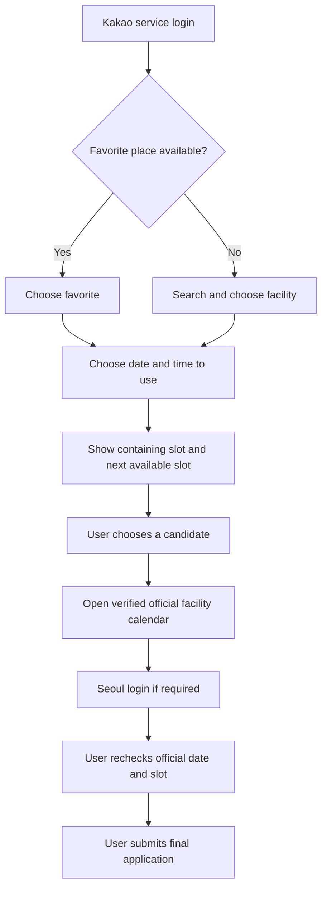

# Seoul Kids Cafe reservation-assistant alpha test

## Alpha objective

Validate that a parent can choose a facility, date, and time once in Seoul Kids, compare two relevant available slots, and move safely to the correct official Seoul facility calendar without the app overstating what was preserved or completed.

The target product may later assist after Seoul login, but that promise is outside the web alpha until an allowed cross-origin runtime and policy approval are proven. See `SEOUL_FLOW_FEASIBILITY.md`.

The alpha never stores Seoul credentials, logs in to Seoul automatically, submits a reservation, cancels a reservation, or reports completion merely because an official page was opened.

## Product flow under test



## Environments

### Logic and UI alpha

Use synthetic facilities and slots. They must be visibly labeled and must never be presented as live availability or recommendation evidence.

```bash
cp .env.example .env.local
# Set ALPHA_USE_FIXTURES=true in .env.local
npm run dev
```

### Connected alpha

Set real values only in `.env.local`:

- `SEOUL_OPEN_API_KEY`
- `NEXT_PUBLIC_KAKAO_JAVASCRIPT_KEY`
- `KAKAO_REST_API_KEY`
- `KAKAO_CLIENT_SECRET` when enabled in Kakao Developers
- `APP_SESSION_SECRET` with at least 32 random characters

Register `{APP_URL}/api/auth/kakao/callback` as the Kakao redirect URI. Keep `ALPHA_USE_FIXTURES=false` for real-data validation.

## Test scenarios

| ID | Scenario | Expected result |
|---|---|---|
| G-01 | Open as a new user with no local profile | No facility is selected on the user's behalf |
| G-02 | Open the facility picker | Search is shown in a separate bottom sheet; the main page does not render a long facility catalogue |
| G-03 | Select a facility | The picker closes and the date/time step appears |
| G-04 | Save 1, 2, and 3 favorite places | Each save is immediate; a fourth place is rejected with clear feedback |
| G-05 | Enter a time inside an available slot | That slot and the next available non-sold-out slot are shown |
| G-06 | Enter a time between slots | The next two available non-sold-out slots are shown |
| G-07 | Complete real Kakao OAuth | The exact selected facility, date, and entered time are restored; record those exact values before and after OAuth |
| G-08 | Use connected facility data | Fixture-only equipment recommendations are absent |
| G-09 | Choose `서울시에서 신청하기` | The verified `BD_selectKidsCafeResveCal.do` facility calendar opens |
| G-10 | Inspect the outbound URL | Facility and calendar month are present; unverified official date/slot fields are absent |
| G-11 | Reach the official page while logged out of Seoul | The official login path returns to the same facility calendar; retained and lost fields are recorded |
| G-12 | Open or return from the official page | The Seoul Kids app does not display `예약 완료` without official evidence or explicit confirmation |
| G-13 | Save a candidate | It is labeled as a reservation candidate and explicitly not a completed reservation |
| G-14 | Review the mobile initial viewport | The first decision and primary action are visible without scrolling through facility or preference lists |
| G-15 | Review wording | Customer UI contains no `Edge AI 예약 도우미`, `추천 회차`, `이 회차 예약`, or ambiguous `원하는 시각` copy |
| G-16 | Feed unknown state to the experimental screen adapter | The experiment stops and never submits the final application |

## Automated gates

```bash
npm test
npm run check
npm run build
npm run alpha:preflight
git diff --check
```

The official URL regression test must prove that:

- the pathname is `BD_selectKidsCafeResveCal.do`;
- `q_fcltyId`, year, and month are present;
- `q_resveDe`, `q_tmeSn`, `q_resveTmeSn`, and `q_reqstPosblCo` are absent.

## Evidence rules

- Record the exact input and restored time; do not treat a different restored time as a pass.
- Keep fixture evidence separate from connected-data evidence.
- An HTTP 200 response proves reachability only, not correct reservation-state preservation.
- Opening an official page does not prove an application was started or completed.
- Unit tests do not replace mobile visual and login-round-trip evidence.
- Do not capture or store Seoul passwords, authorization codes, or authenticated URLs.

## Exit criteria

The web alpha is complete only when:

- all automated gates pass;
- G-01 through G-16 have current pass/fail evidence against the redesigned flow;
- G-07 uses matching before/after values from a real Kakao OAuth round trip;
- G-11 is verified in Kakao in-app browser and one normal mobile browser;
- official handoff limitations are visible to the user;
- connected mode exposes no fixture-only recommendation;
- no test shows automatic final submission, Seoul credential storage, or unsupported completion claims;
- the read-only UMPPA slot endpoint risk is accepted for the closed alpha or replaced.

## Post-alpha decision

After the web alpha, choose one path explicitly:

1. Keep the product as an honest reservation-preparation assistant.
2. Validate a native or otherwise allowed runtime for official-page assistance.
3. Pursue a Seoul-supported integration.

Do not silently treat option 1 as if it already provides option 2.
