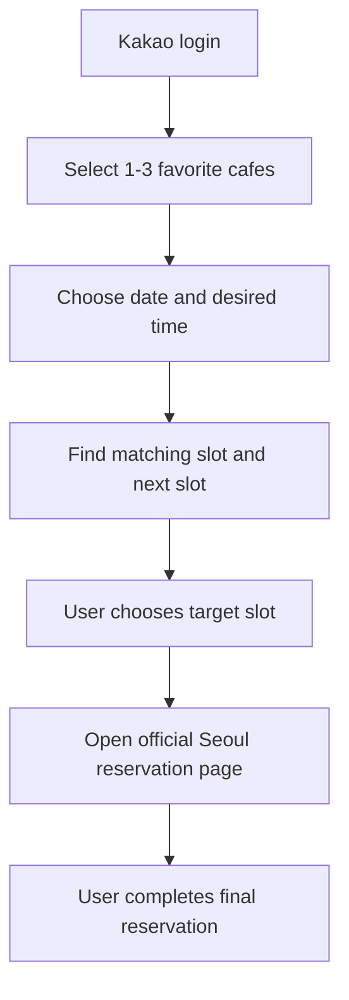
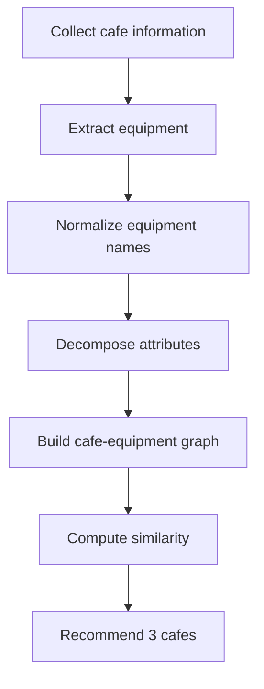

# Seoul Kids Cafe MVP Handoff

## Background

The project started from an observed usability problem in the current Seoul Kids Cafe reservation journey:

- Users must repeatedly select facility, date, and time.
- Login interrupts the reservation flow.
- After login, users often need to return and repeat prior choices.
- Popup notices and separate calendar/time selections create friction.
- Map/search experience is not optimized for parents who repeatedly use the same few facilities.

The MVP should reduce reservation preparation friction while keeping the final official reservation action inside the Seoul system.

## Core judgment

The MVP should not try to replace Seoul login or official reservation submission at this stage.

The near-term product should work as a reservation assistant:

1. Remember the user's preferred facilities and reservation intent.
2. Read facility and slot availability.
3. Recommend the relevant reservation slot.
4. Open the official Seoul reservation page with as much context preserved as possible.
5. Let the user complete final reservation confirmation.

## Confirmed product direction

### Main flow



### Main UI

Only three primary cards should appear on the main screen:

| Card | Purpose | Constraint |
|---|---|---|
| One-tap reservation assistant | Find target slot and move to official reservation | Seoul final reservation remains user-controlled |
| Favorite facilities | Show 1-3 frequently used cafes | User can select 1, 2, or 3 |
| Recommended cafes | Recommend 3 similar cafes | Based on preferred equipment survey and ontology |

Other features should be moved to a separate page, popup, drawer, or future version.

### Map

Map should not dominate the main screen.

Recommended options:

| Option | Use case |
|---|---|
| Separate in-app map page | Facility exploration and nearby recommendations |
| Kakao Map deep link | Fast navigation and low implementation burden |
| Hybrid | Main MVP uses deep link first; in-app map becomes v2 |

## Data sources

| Data | Source | Status |
|---|---|---|
| Facility base data | Seoul Open API `tnFcltySttusInfo1011` | Official API |
| Reservation slots | UMPPA public endpoint `ND_selectResveTmeList.do` | Read-only, unofficial |
| Reservation calendar | UMPPA public calendar page | Read-only, unofficial |
| Equipment data | Facility pages/manual collection/survey enrichment | Collection needed |
| User preferences | In-app survey | To implement |

## Environment variables

Use `.env.local` for actual values.

Do not commit real keys.

```text
SEOUL_OPEN_API_KEY=
SEOUL_RESERVATION_API_KEY=
NEXT_PUBLIC_KAKAO_JAVASCRIPT_KEY=
KAKAO_REST_API_KEY=
```

## Ontology direction

The recommendation system should be built around a kids cafe ontology.

### Ontology pipeline



### Entity model

| Entity | Examples |
|---|---|
| Cafe | facility id, name, district, address, geo, reservation path |
| Equipment | slide, ball pool, trampoline, climbing, blocks |
| Attribute | physical activity, sensory play, pretend play, toddler-safe |
| Preference | liked equipment, disliked equipment, child age, favorite cafe |
| Recommendation | similar cafe, reason, confidence, source |

### Algorithm boundary

Recommendation logic must be modular:

- `collect`: raw source ingestion
- `normalize`: equipment and facility normalization
- `ontology`: entities and relationships
- `similarity`: rule/embedding/vector comparison
- `recommend`: ranked output for UI

The first version can use rules and tags. Embedding-based similarity can be added after enough structured data exists.

## Known issues to address next

1. UI readability is weak in the one-tap reservation test modal.
   - Add stronger color hierarchy.
   - Make slot cards visually distinguishable.
   - Make time, type, and remaining seats easier to parse.

2. Map view is not working.
   - Check Kakao key loading.
   - Check script initialization.
   - Check fallback deep link behavior.

3. Favorite facility management has no clear next response after selection.
   - Allow 1-3 selections.
   - Add save confirmation.
   - Update main cards immediately after save.

4. Login flow remains unresolved.
   - Do not store Seoul login credentials.
   - Explore UX designs that ask users to login early or only at reservation time.
   - Preserve selected facility/date/time through redirects when possible.

5. Reservation automation risk remains unresolved.
   - Avoid automatic final submit.
   - Keep final reservation button user-controlled.
   - Consider clipboard/autofill/browser-assist only after policy review.

## Recommended next Codex task prompt

```text
Read AGENTS.md and PROJECT_HANDOFF.md first.

Then continue the Seoul Kids Cafe MVP from the current repository state.

Priority tasks:
1. Improve one-tap reservation modal readability with stronger color hierarchy and clearer slot cards.
2. Fix map view or add a reliable Kakao Map deep-link fallback.
3. Update favorite facility management so users can select 1, 2, or 3 facilities and receive immediate UI feedback after saving.
4. Keep recommendation and ontology logic modular.
5. Run npm run check and npm run build before reporting completion.

Do not store real API keys.
Do not implement Seoul credential storage or automatic final reservation submission.
```

## Verification commands

```bash
npm install
npm run check
npm run build
```
