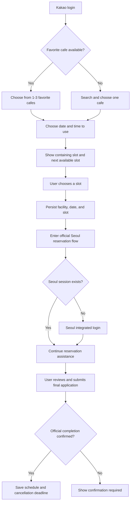
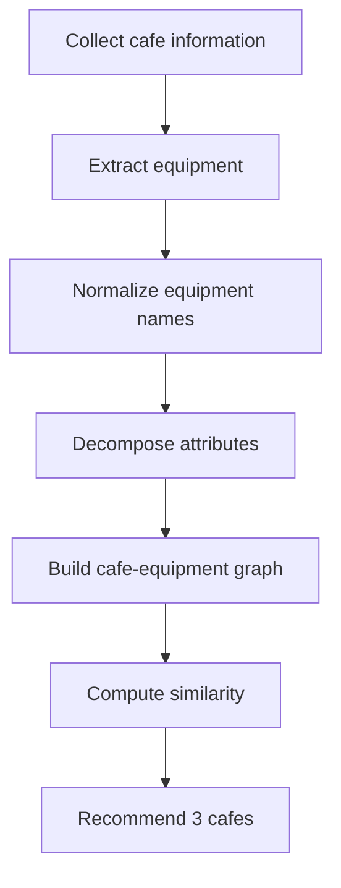

# Seoul Kids Cafe MVP Handoff

> **Current continuation document:** Read [`RESEARCH_IMPLEMENTATION_HANDOFF.md`](./RESEARCH_IMPLEMENTATION_HANDOFF.md) first. It records the 2026-09-02 decisions that split the work into research and implementation tracks and supersedes conflicting product-direction statements below. This file remains as implementation history and earlier feasibility context.

## Background

The project started from an observed usability problem in the current Seoul Kids Cafe reservation journey:

- Users must repeatedly select facility, date, and time.
- Login interrupts the reservation flow.
- After login, users often need to return and repeat prior choices.
- Popup notices and separate calendar/time selections create friction.
- Map/search experience is not optimized for parents who repeatedly use the same few facilities.

The MVP should reduce reservation preparation friction while keeping the final official reservation action inside the Seoul system.

## Core judgment

The product exists to remove repetition and broken context from the reservation journey. It is not a facility portal, map product, automatic reservation bot, or an AI showcase.

### Product goal

> Help a parent choose a facility, date, and time once; preserve that choice through the Seoul login boundary; and safely continue to the user-controlled final application on the official Seoul page.

The user promise is:

1. Choose the reservation intent once.
2. Compare only the slot containing the chosen time and the next available slot.
3. Preserve the facility, date, and slot across Kakao and Seoul login transitions as far as the verified integration permits.
4. Never claim that a reservation is complete until official completion is confirmed.
5. Keep the final application action under the user's control.

Edge AI is an implementation option for reducing interruption after Seoul login. It is not itself the product goal and must not be marketed as working until an allowed runtime can actually observe and assist the cross-origin official flow.

## Confirmed product direction

### Main flow



### Main UI

The main screen is a short reservation journey, not a vertical catalogue of every feature. One screen should ask for one decision, and the primary action must be visible without scrolling through facility lists or recommendation surveys.

| Surface | Purpose | Constraint |
|---|---|---|
| Reservation home | Start or resume one reservation | No technical Edge AI explanation |
| Favorite facilities | Accelerate facility choice | Show 1-3; never auto-select an unregistered facility |
| Facility search | Select a cafe when no favorite applies | Separate sheet/page; no repeated large add buttons |
| Slot choice | Compare exactly two relevant choices | Containing slot and next available slot |
| Recommendations | Help only when the user cannot choose a cafe | Hidden until real, sourced equipment coverage exists |

Other features should be moved to a separate page, popup, drawer, or future version.

### Language principles

- Use customer outcomes, not implementation language.
- Prefer "time to use" over ambiguous or technical wording such as "reservation intent" in the UI.
- Use "Apply on Seoul" rather than copy implying that clicking the outbound link completes a reservation.
- Label the first slot "Contains your selected time", not "Recommended slot".
- Use "Favorite places" consistently instead of mixing "my facilities", "selected facility", and favorites.

### Facility location

The MVP does not include a map. Show the official facility address in the selection list and in the selected reservation summary. Reconsider map or directions only after the core reservation flow is validated.

## Data sources

| Data | Source | Status |
|---|---|---|
| Facility base data | Seoul Open API `tnFcltySttusInfo1011` | Official API |
| Reservation slots | UMPPA public endpoint `ND_selectResveTmeList.do` | Read-only, unofficial |
| Reservation calendar | UMPPA public calendar page | Read-only, unofficial |
| Equipment data | Facility pages/manual collection/survey enrichment | Not available in connected facility data; fixture tags are not product evidence |
| User preferences | Progressive pre/post-visit prompts | Future; do not require an up-front survey |

## Environment variables

Use `.env.local` for actual values.

Do not commit real keys.

```text
SEOUL_OPEN_API_KEY=
SEOUL_RESERVATION_API_KEY=
NEXT_PUBLIC_KAKAO_JAVASCRIPT_KEY=
KAKAO_REST_API_KEY=
```

## Ontology direction

The recommendation system should be built around a kids cafe ontology.

### Ontology pipeline



### Entity model

| Entity | Examples |
|---|---|
| Cafe | facility id, name, district, address, geo, reservation path |
| Equipment | slide, ball pool, trampoline, climbing, blocks |
| Attribute | physical activity, sensory play, pretend play, toddler-safe |
| Preference | liked equipment, disliked equipment, child age, favorite cafe |
| Recommendation | similar cafe, reason, confidence, source |

### Algorithm boundary

Recommendation logic must be modular:

- `collect`: raw source ingestion
- `normalize`: equipment and facility normalization
- `ontology`: entities and relationships
- `similarity`: rule/embedding/vector comparison
- `recommend`: ranked output for UI

The first version can use rules and tags. Embedding-based similarity can be added after enough structured data exists.

## Known issues to address next

1. The official outbound URL is wrong for reservation entry.
   - The app previously used `BD_selectKidsCafeResveRs.do`.
   - It now uses the verified facility calendar entry point and has a regression test for excluded date/slot parameters.
   - Verify and use the official calendar/application entry flow (`BD_selectKidsCafeResveCal.do`) without claiming that query parameters preserve more context than is proven.

2. The Seoul-login continuation is the primary product feasibility gate.
   - Public-page inspection confirms that the official login return URL retains the facility but not the selected date or slot.
   - The official page keeps date and slot in local form state and POSTs to `BD_insertKidsCafeForm.do`; an ordinary cross-origin web handoff cannot restore or operate those controls.
   - Test the remaining login return behavior in Kakao in-app browser and normal mobile browsers.
   - Until an allowed assisting runtime is proven, ship an honest reservation-preparation handoff rather than an Edge AI claim.
   - See `SEOUL_FLOW_FEASIBILITY.md` for evidence, runtime options, and remaining real-device tests.

3. The current main page is too long and mixes unrelated decisions.
   - Rebuild it as a staged reservation journey.
   - Never preselect the first loaded facility for a new user.
   - Keep facility search and preference collection out of the primary vertical flow.

4. Equipment recommendations are fixture-only.
   - Hide them in connected mode until sourced facility-equipment data exists.
   - Store source, observed date, normalized category, and coverage before enabling recommendations.

5. Reservation state is not trustworthy enough.
   - Opening the official page means "application in progress", not "complete".
   - Show completion only with official evidence or explicit user confirmation.

6. Reservation automation risk remains unresolved.
   - Never store Seoul credentials.
   - Never automatically submit or cancel.
   - Review policy before enabling official-page observation or autofill.

## MVP completion gates

The MVP is complete only when all of the following are evidenced:

1. A new user sees no fabricated facility selection.
2. The entered date and time survive a real Kakao OAuth round trip exactly.
3. Slot matching returns the containing available slot and the next available slot, skipping sold-out slots.
4. The outbound action opens the verified official reservation entry page.
5. Seoul-login return behavior and preservation limits are documented from real-device tests.
6. The app never reports completion merely because the official page was opened.
7. Final submission remains user-controlled.
8. The core flow works in Kakao in-app browser and a normal mobile browser.
9. Connected-mode recommendations are supported by sourced real equipment data or are absent.
10. `npm run check` and `npm run build` pass.

## Recommended next Codex task prompt

```text
Read AGENTS.md and PROJECT_HANDOFF.md first.

Then continue the Seoul Kids Cafe MVP from the current repository state.

Priority tasks:
1. Treat the product goal and MVP completion gates in this handoff as authoritative.
2. Verify the official reservation entry URL and Seoul-login return behavior before redesigning the UI.
3. Remove misleading Edge AI and reservation-complete claims from the customer journey.
4. Rebuild the main experience as the staged facility -> date/time -> two-slot -> official-application flow.
5. Hide fixture-only equipment recommendations in connected mode.
6. Run npm run check and npm run build before reporting completion.

Do not store real API keys.
Do not implement Seoul credential storage or automatic final reservation submission.
```

## Verification commands

```bash
npm install
npm run check
npm run build
```
