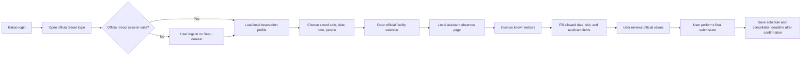
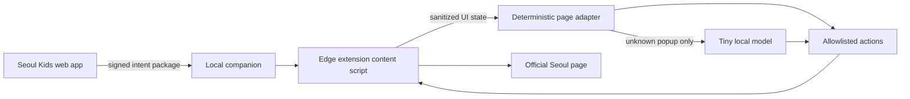

# Seoul Kids Cafe — Research & Implementation Handoff

Updated: 2026-09-02
Status: product direction recorded; research and full local assistant are not complete.

## Start here

The service improves an already successful public service; it does not claim that Seoul Kids Cafe itself is broken. It is free to users, keeps final reservation authority with Seoul, and aims to become a useful partner to Seoul through measurable operational value.

The work now has two coordinated tracks:

1. **Research:** validate the narrow reservation pain, build consented non-sensitive knowledge, and test public-value outcomes.
2. **Implementation:** build the shortest repeat-reservation flow and a lightweight local assistant that can dismiss known popups and restore allowed fields on the official page.

## Confirmed product decisions

| Area | Decision |
|---|---|
| Positioning | Convenience layer for an already useful and highly rated public service |
| Price | Free for users |
| Long-term partner | Seoul Metropolitan Government, districts, and facility operators |
| Promotion | Minimal, non-disruptive placements limited to public policy, new facilities, and useful childcare information |
| Customer promise | Remember repeat reservation preferences and reduce interruption before the user-controlled final application |
| Destination choice | Do not choose a cafe for the family without sourced facility evidence |
| Final submission | Always reviewed and triggered by the user on the official Seoul flow |
| Seoul credentials | Never collect or store the user's Seoul password |
| Core IP | Keep server-side orchestration, ontology, ranking, and analytics private; assume any client-shipped model or extension can be inspected |
| Data use | Separate service operation from optional research/content consent; exclude sensitive data and direct identifiers |

## Target flow



### Recommended login method

- Kakao OAuth establishes the Seoul Kids service identity.
- Immediately after onboarding, open the official Seoul login page in the same supported browser profile.
- The user enters credentials only on the Seoul-owned origin; the official session cookie stays under Seoul's control.
- The local companion detects only whether the official page is logged in, not the password or authentication token value.
- On expiry, return the user to official login and resume from the locally stored reservation intent.
- Test normal Edge first. Kakao in-app browser can launch the service but cannot be assumed to host a browser extension.

## Research track

### Research goal

Find the exact customer activity that is worth decoupling, then accumulate consented evidence that can improve reservation assistance, facility operations, public information, and later research.

### Existing desk research

- [Pain-point 5W questions and evidence](docs/research/PAIN_POINTS_5W.md)
- [Product uniqueness and customer 5W](docs/research/PRODUCT_UNIQUENESS_5W.md)
- [Shared evidence ledger](docs/research/EVIDENCE_LEDGER.md)

The current evidence challenges a broad `reservation is inconvenient` claim. Reported top issues were parking, limited session length, and access; overall satisfaction and revisit intent were high. The narrower repeat-reservation interruption hypothesis remains unverified.

### Research backlog

| Priority | Work | Output | Decision gate |
|---:|---|---|---|
| R0 | Observe five real reservations from intent to official completion | Timestamped journey, repeated fields, failures, workarounds | Identify at least one repeated high-cost activity |
| R0 | Interview 3 successful users, 3 failed/abandoned users, 2 new/non-users | Behavior-based 5W notes | Select initial persona or stop the hypothesis |
| R0 | Measure official favorites, personal alarms, and Requ as alternatives | Comparative task results | Prove value beyond list, link, or alert |
| R1 | Validate whether popup and field assistance saves time without reducing trust | Before/after task test | Lower completion time or error rate |
| R1 | Test cancellation reminders | Opt-in rate and missed-cancellation rate | Evidence of operational/public value |
| R1 | Validate optional post-visit questions | Completion rate and data quality | Keep only low-burden questions |
| R2 | Discuss policy and integration with Seoul | Allowed runtime/API/data-use record | Partnership-compatible implementation |
| R2 | Prepare formal research protocol | Consent, retention, withdrawal, ethics/IRB review | Required before publication-grade human-subject research |

### Proposed data, purpose, and boundary

| Data | Granularity | Purpose | Consent | Boundary |
|---|---|---|---|---|
| Child sex | Optional category including prefer not to answer | Aggregate usage differences | Research opt-in | Never expose individual profiles |
| Child age | Derived age band | Eligibility and aggregate analysis | Service when needed; research separately | Prefer band over exact age |
| Birth year and month | Optional YYYY-MM | Age calculation and cohort research | Explicit research opt-in | Do not collect day; encrypt and delete when no longer needed |
| Party size | Per reservation | Valid form assistance and demand analysis | Service | Avoid identities of companions |
| Parent age band | Optional decade band | Aggregate persona research | Research opt-in | Do not collect exact birth date |
| Favorite equipment | Controlled vocabulary plus unknown | Personal record and later hypothesis testing | Optional | Not a recommendation fact by itself |
| Used/long-played equipment | Post-visit observation | Facility-equipment preference evidence | Optional research opt-in | Record source, date, and confidence |
| Facility and slot activity | Pseudonymous event | Flow improvement and aggregate demand | Service analytics disclosure | Short retention; no cross-service tracking |
| Cancellation/no-show outcome | Minimal status | Reminder evaluation and public-value research | Explicit disclosure | Never infer health or family circumstances |

### Ontology direction

Neo4j is a later storage and analysis option, not an excuse to collect data early.

```text
(PseudonymousHousehold)-[:HAS_CHILD]->(ChildCohort)
(ChildCohort)-[:LIKES {source, observedAt, confidence}]->(Equipment)
(Facility)-[:HAS_EQUIPMENT {source, observedAt, confidence}]->(Equipment)
(Visit)-[:AT]->(Facility)
(Visit)-[:USED]->(Slot)
(Visit)-[:OBSERVED_PLAY {durationBand}]->(Equipment)
(Reservation)-[:FOR]->(Facility)
(Reservation)-[:HAS_OUTCOME]->(Outcome)
```

Keep identity/authentication data outside Neo4j. Use a rotating pseudonymous subject ID. Every facility/equipment claim requires provenance and observation time. Do not infer development, diagnosis, or health status from play behavior.

### Research outputs that may support Seoul collaboration

- Reservation preparation time and repeated-input reduction
- Login/popup/field-level abandonment points
- Cancellation reminder opt-in and missed-cancellation change
- Aggregate age-band demand versus facility eligibility
- Sourced equipment demand and under-served facility patterns
- Public-policy and new-facility information engagement

## Implementation track

### Current base in the repository

| Component | Current state |
|---|---|
| Kakao OAuth and signed app session | Implemented; local configuration and real round-trip were exercised during alpha work |
| Facility list | Seoul Open API adapter exists |
| Reservation slots | Read-only public UMPPA endpoint adapter exists; production permission remains a policy risk |
| Favorite facilities | Local profile supports up to three |
| Reservation intent | Facility, date, and desired time persist locally |
| Slot selection | Containing slot plus next available slot logic and tests exist |
| Official handoff | Correct facility calendar URL builder and regression test exist |
| Edge assistant | Synthetic screen-state classifier and safe-action tests only; no real page integration |
| Equipment recommendation | Fixture/rule experiment only; not product evidence |
| Neo4j | Not implemented |
| Research consent and telemetry | Not implemented |

### Recommended local-assistant architecture



- Use deterministic selectors for known popups and fields; invoke a tiny local model only for unknown notice classification.
- Run the model locally through a companion process, preferably via ONNX Runtime or a similarly lightweight runtime.
- Restrict actions to an allowlist: dismiss known notice, highlight login, select date, select slot, fill approved fields, highlight final submit, stop.
- Never include final submit, payment, cancellation, credential capture, or arbitrary clicking in the action set.
- Sign the intent package from the service and validate origin, facility, date, expiry, and schema in the companion.
- Keep proprietary orchestration and ontology services server-side. A locally distributed model and extension cannot be fully hidden.

### Implementation backlog

| Priority | Work | Acceptance evidence |
|---:|---|---|
| I0 | Redesign the main UI as staged `login → cafe → date/time → two slots → Seoul` flow | Mobile viewport requires one decision per stage; no fabricated default facility |
| I0 | Define the local intent package and allowlisted action protocol | Versioned schema, signature verification, expiry, negative tests |
| I0 | Build Edge extension proof of concept for the official calendar | Known popup dismissal and field fill on a saved offline DOM fixture |
| I0 | Validate official Seoul login/session behavior | Credentials stay on official origin; session expiry and resume documented |
| I0 | Real-device test five bookings without automatic final submission | Exact screen recording and failure log |
| I1 | Package a lightweight local classifier fallback | Model size/startup/memory benchmark; deterministic path remains default |
| I1 | Add schedule and cancellation deadline confirmation | Never mark complete merely because official page opened |
| I1 | Add separate research opt-in and withdrawal | Consent version, purpose, retention, export/delete behavior tested |
| I1 | Add privacy-preserving event schema | No direct identifiers or credentials in events |
| I2 | Add provenance-first equipment collection | Source, observed date, confidence, normalized equipment ID |
| I2 | Introduce Neo4j behind a repository interface | Identity data excluded; migrations and deletion tests |
| I2 | Build public-value aggregate reports | Minimum cohort thresholds and re-identification review |

## Non-negotiable safety and truthfulness

- Do not store Seoul credentials or copy official session cookies into the service backend.
- Do not automatically perform final reservation submission, payment, or cancellation.
- Do not claim AI assistance works on the real official page until real runtime tests pass.
- Do not claim a reservation is complete without official confirmation.
- Do not expose fixture equipment tags as real facility facts.
- Do not collect exact birth dates, child names, detailed addresses, health data, or free text that invites sensitive disclosures.
- Do not use optional research data for service access, advertising targeting, or individual profiling.
- Re-check Seoul terms, automation policy, privacy requirements, and human-subject research obligations before connected trials or publication.

## Suggested next-task prompt

```text
Work in the existing seoul_kids checkout. Read AGENTS.md, RESEARCH_IMPLEMENTATION_HANDOFF.md, PROJECT_HANDOFF.md, and SEOUL_FLOW_FEASIBILITY.md first.

Continue only the implementation I0 track. Preserve the research and safety boundaries. Start by defining a signed, versioned local intent/action protocol and an Edge extension proof of concept against a saved offline fixture of the official calendar. Use deterministic selectors for known UI; use a local model only as a fallback for unknown popup classification. Never store Seoul credentials or automate final submission. Run npm run check and npm run build before handoff.
```

For research work, replace `implementation I0 track` with `research R0 track` and produce evidence artifacts before changing the product direction.

## Verification commands

```bash
npm run check
npm run build
git diff --check
```
